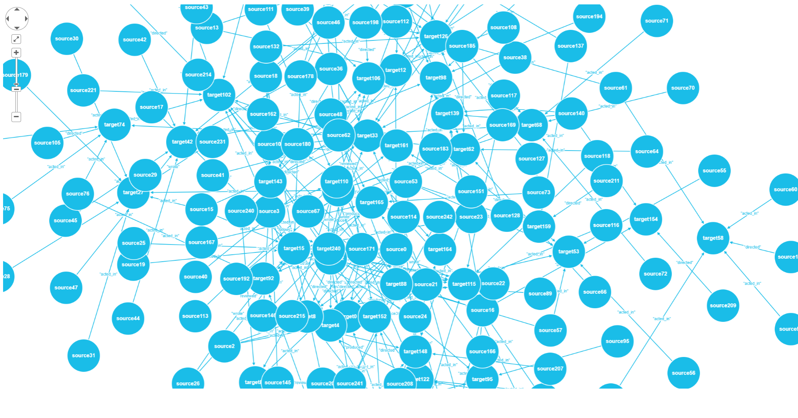

# GraphUtilities
- Graph data Drawing utilities by AgensGraph, GraphWidget(Cytoscape.js+Coffeescript.js)
- STS springboot
- RESTful by Hateoas(Level 3)
- by java
- Thymeleaf example. (but, Data must be imported.)
- User-Defined logger
- GraphWidget example source : https://callin2.github.io/graph_wiget/

# How to use GraphUtilies 
## step 1. Installation AgensGraph version 1.2↑ (base on PostgreSQL)
[agensgraph link] : https://github.com/bitnine-oss/agensgraph

pg_hba.conf edit
````
host  all all your_ip trust(or md5 (used password))
````

postgresql.conf edit
````
listen_addresses = '*'
````

## step 2. Graph data import
````
agens=# \i $file_path (e.g. \i /home/user/file.txt)
or 
agens=# CREATE (a:test {name:'person1'})-[r:knows]->(b:test {name:'person2'});
````

## step 3. Source import 
- git clone : https://github.com/jhs9396/GraphUtilities.git
- STS import

## step 4. Graph data "MATCH" / GraphUtilities method use

````
@Autowired
@Qualifier("GraphUtil")
GraphUtilities gu;      // graph utilities bean object use

...
public void testMethod(){
     ....
     gu.node("source vertex id", "source vertex name");
     gu.node("target vertex id", "target vertex name");
     gu.edge("edge id", "edge label name", "source vertex id", "target vertex id");
     ....
}
````
# gu.node, edge format

````
public void node(Object id, Object name) {
	JSONObject node = new JSONObject();
	JSONObject data = new JSONObject();

	data.put("id",    id);
	data.put("name",  name);

	node.put("group", "nodes");
	node.put("data",  data);

	nodes.add(node);
}

public void edge(Object id, Object label, Object source, Object target) {
	JSONObject edge = new JSONObject();
	JSONObject data = new JSONObject();

	data.put("id",     id);
	data.put("label",  label);
	data.put("source", source);
	data.put("target", target);

	edge.put("group",  "edges");
	edge.put("data",   data);

	edges.add(edge);
}
     
// not yet style setting. but very easy. soon updating.
````

# Nodes, Edges clear

````
gu.graphInit();
````

# Graph data to JSONArray

````
gu.toJsonArray();
````

## get uri call : http://localhost:8080/index

result view - AgensGraph Vertex data, Edge data visualization by GraphWidget.js
but, Any JSONArray data that matches the Cytoscape format is all that is possible



# Update to future
- I want to provide functionality as a React component. 
- as soon as possible (maybe 1 month)

